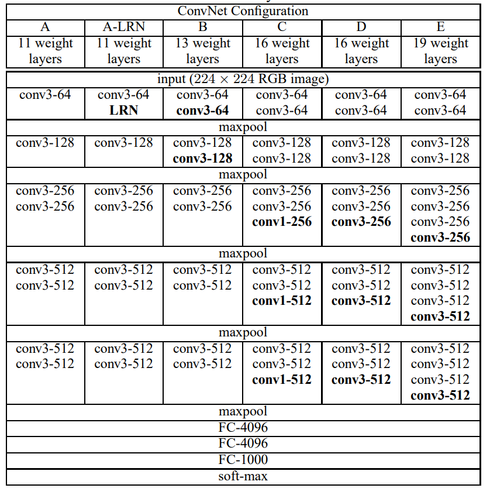

# Lab Session 1 

**Made by:**

- Zijie NING @[mm0806son](https://github.com/mm0806son)
- Guoxiong SUN @[GuoxiongSUN](https://github.com/GuoxiongSUN)

-----

### TASK 1. Train a model from scratch

Choose a model among the following ones : 

- ResNet
- PreActResNet
- DenseNet
- ***VGG***

Next, adapt its hyperparameters to make the model suitable for MINICIFAR, and train it from scratch. 

### Architecture of VGG

### Play with hyperparameters

**Hyperparameters to modify:**

- Network

  - ***num of hidden layers***
  - ***num of hidden layer units***
  - activation function
- Optimization

  - ***learning rate***
  - ***n_epochs***
  - ***batch-size***
  - optimizer(SGD, Adam, ...)
  - transform
- Regularization(**deal with overfitting**)

  - ***weight_decay***
- dropout

We start by executing the calculation on`VGG16` with `lr=0.1`.

After 200 epochs, we resume by using `lr=0.01`. We notice that the loss in the validation set and that in the test set gradually increase, so we conclude that there is an overfitting.

The learning rate is the first hyperparameter that comes to our mind. This figure shows the loss function with different learning rate `lr`. When the learning rate is large, the model learns fast and the loss function decreases quickly, but it tends to oscillate around the optimal solution, causing the loss to fluctuate up and down.

We then try to modify the `weight_decay`, which is the $\lambda$ in the equation (1). By adding this parameter, we penalize overly complex models to prevent overfitting.
$$
\min _{\theta} \frac{1}{2 m} \sum_{i=1}^{m}\left(h_{\theta}\left(x^{(i)}\right)-y^{(i)}\right)^{2}+\lambda \sum_{j=1}^{n} \theta_{j}^{2}
$$
This figure shows the loss function with different `weight_decay`. Notice that too large a penalty factor can lead to an oversimplified model, which in turn leads to underfitting.

This figure shows the loss function with different `batch_size`. In this case we chose R=5 (3200 in the train set and 800 in the validation set). The time required for each epoch ranges from about 1.8s to 1.15s. We notice that as the batch size becomes larger, the time to train each epoch gradually becomes smaller.

### Deal with overfitting

**Main idea:** `weight_decay` -> `VGG11` -> More data
To deal with overfitting, we firstly think about regularization by using `weight_decay`. Unfortunately we were not able to obtain satisfactory results and it is easy to cause underfitting.

We then considered reducing the depth of the network, so we tried VGG11. This time our overfitting improved and the network was computed faster.

Later, we noticed that we were using only one-fifth of the dataset, and increasing the number of samples is always the most efficient way to solve overfitting. The cost is higher storage space requirements and longer computation time, but these are acceptable for the current computing power we have.

Finally with `weight_decay=5e-4`, `lr=0.03`, `batch_size=800` and 100 epoch on VGG11, we get this figure with a accuracy of **91.275%**. It took us about 20min.

### TASK 2. Figure Accuracy vs Number of Parameters
Consider the four models of TASK 1. and, taking in account the [accuracy obtained on CIFAR10](https://github.com/kuangliu/pytorch-cifar), generate a graph accuracy vs number of parameters.

## Part 4 - Project

Prepare a presentation (10 minutes + 5 minutes question) with the following content : 
- Description of the chosen architecture
- Hyperparameter exploration strategy 
- Results on MINICIFAR, focusing on illustrating the **compromises between model size, training time and performance**

