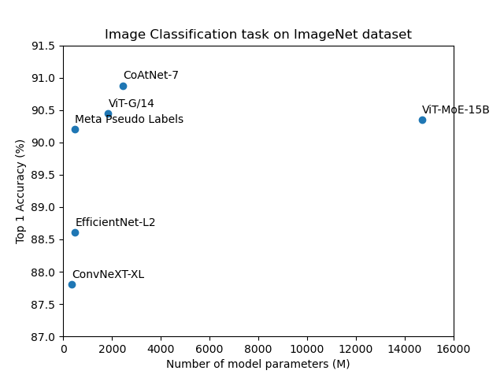

# Lab Session 1 

The objectives of this first lab session are the following:
- Familiarize yourself with pytorch
- Train a model from scratch using a state of the art architecture
- Train a classifier using Transfer Learning from a pretrained model
- Explore hyperparameters of a given architecture

We will perform all experiments on the CIFAR10 dataset, as well as a subsamples of CIFAR10. 

---
## Part 1

Familiarize yourself with pytorch by doing the [Pytorch_tutorial.ipynb](Pytorch_tutorial.ipynb), a jupyter notebook that you will be able to run also in VScode, after installing the Jupyter extension (remember to "Trust" the notebook, as explained [here](https://code.visualstudio.com/docs/python/jupyter-support)). If you are familiar with pytorch, you can go quickly over the tutorial and try to train a classifier in section 4 where you are asked to complete some cells.

---
## Part 2 


The file [minicifar.py](minicifar.py) downloads the CIFAR10 dataset, and performs a subsampling to generate the MINICIFAR dataset. Look at this file carefully to understand how the dataset are generated: the number of retained classes can be configured, as well as the ratio of the full dataset and the percentage of training and validation sets.


Remember that it is important to check how well your network generalizes looking at the performances on the validation set.

The following code can be using to obtain a DataLoader, ready for training in pytorch : 
```python

from minicifar import minicifar_train,minicifar_test,train_sampler,valid_sampler
from torch.utils.data.dataloader import DataLoader

trainloader = DataLoader(minicifar_train,batch_size=32,shuffle=True,sampler=train_sampler)
validloader = DataLoader(minicifar_train,batch_size=32,shuffle=True,sampler=valid_sampler)
testloader = DataLoader(minicifar_test,batch_size=32) 
```


We will now define a state of the art deep model and train it from scratch. Check out [here](https://github.com/kuangliu/pytorch-cifar/tree/master/models) for reference implementations of modern deep models for CIFAR10. 

### TASK 1. Train a model from scratch

Choose a model among the following ones : 
- ResNet
- PreActResNet
- DenseNet
- VGG
  

Next, adapt its hyperparameters to make the model suitable for MINICIFAR, and train it from scratch. Try to get as close as possible to the [results obtained on CIFAR10](https://github.com/kuangliu/pytorch-cifar). 


A few hints : 
- Learning rate is a very important (if not the most important) hyperparameter, and is routinely scheduled to change a few times during training. A typical strategy is to divide it by 10 when reaching a plateau in performance. 
- Be careful with overfitting, which happens when the gap between Train and Test accuracy keeps getting larger. 
- Think about plotting and saving your results, so as not to lose track of your experiments. 


### TASK 2. Figure Accuracy vs Number of Parameters
Consider the four models of TASK 1. and, taking in account the [accuracy obtained on CIFAR10](https://github.com/kuangliu/pytorch-cifar), generate a graph accuracy vs number of parameters such as this one



---
## Part 3: TRANSFER LEARNING

For Transfer Learning, we have pretrained the models adapted to CIFAR 10

- ResNet
- PreActResNet
- DenseNet
- VGG

of the [repository](https://github.com/kuangliu/pytorch-cifar) using a larger dataset [CIFAR-100](https://www.cs.toronto.edu/~kriz/cifar.html) . CIFAR-100 is just like the CIFAR-10, except it has 100 classes containing 600 images each. To reduce the overlap between the lables from CIFAR-10 and CIFAR-100, we ignored super-classes of CIFAR-100 that are conceptually similar to CIFAR-10 classes. 

You can load the models from the folder models_cifar100, for example using

```python
import models_cifar100
backbone=models_cifar100.ResNet18()
```

then download the pretrained model weights  at this [link](https://partage.imt.fr/index.php/s/o4ZzekyBHjgx4iS) and load them 

```python
if torch.cuda.is_available():
    state_dict=torch.load(backbone_weights_path)
else:
    state_dict=torch.load(backbone_weights_path,map_location=torch.device('cpu'))

backbone.load_state_dict(state_dict['net'])

```

The backbone can be used to generate feature vectors, which will serve as input to a classifier (e.g. last fully connected layer) to perform classification on MINICIFAR. One way to do this is presented in [this tutorial](https://pytorch.org/tutorials/beginner/transfer_learning_tutorial.html#convnet-as-fixed-feature-extractor), but you can also easily find other ones. For instance, after having trained only the classifier (transfer learning) you may want to **fine-tune for a few epochs the whole model** to improve performances.

---

## Part 4 - Project

Prepare a presentation (10 minutes + 5 minutes question) with the following content : 
- Description of the chosen architecture
- Hyperparameter exploration strategy 
- Results on MINICIFAR, focusing on illustrating the **compromises between model size, training time and performance**

If you are ahead in time, you can perform similar experiments on CIFAR-10 and CIFAR-100, but be aware that each run (e.g. 350 epochs) might take as long as 3 hours.

**N.B. It is very important that you consider the models in the kuangliu repository, as they have been dimensioned for the CIFAR-10 dataset. Respective models taken from other sources may be have been optimized for other datasets and therefore not adapted (over or underparametrized) to CIFAR-10.**