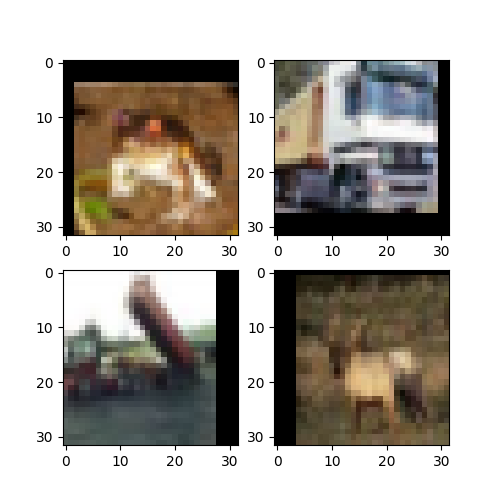

# Lab Session 4

The objectives of this lab session are the following:
- Visualize augmented data samples
- Experiment with Data Augmentation
- Implement mixup in your training loop

All experiments done on CIFAR10.

---
## Part 1 - Visualization of DA

Data augmentation (DA) in Pytorch is done when defining the Dataset class. In order to enable DA, the class must accept a transforms argument, which will dynamically modify the original data samples by applying them a function. Most of the time, this function is a composition of several functions. Let's have a look at the default CIFAR10 transforms we have been using so far : 

```python
from torchvision.datasets import CIFAR10
import torchvision.transforms as transforms

transform_train = transforms.Compose([
    transforms.RandomCrop(32, padding=4),
    transforms.RandomHorizontalFlip(),
    transforms.ToTensor(),
    transforms.Normalize((0.4914, 0.4822, 0.4465), (0.2023, 0.1994, 0.2010))
])

transform_test = transforms.Compose([
    transforms.ToTensor(),
    transforms.Normalize((0.4914, 0.4822, 0.4465), (0.2023, 0.1994, 0.2010))
])

rootdir = './data/cifar10'

c10train = CIFAR10(rootdir,train=True,download=True,transform=transform_train)
c10test = CIFAR10(rootdir,train=False,download=True,transform=transform_test)
```

DA here is done by two random transformations : 
- [RandomCrop](https://pytorch.org/vision/main/generated/torchvision.transforms.RandomCrop.html), which crops the image at a random location and pads the borders, and 
- [RandomHorizontalFlip](https://pytorch.org/vision/main/generated/torchvision.transforms.RandomHorizontalFlip.html#torchvision.transforms.RandomHorizontalFlip).

A few important notes :
- ToTensor() converts the images to torch Tensors
- Normalization is performed so that the input values follow the normal distribution
- DA is applied only for the training set. For the test set, only normalization is applied


In order to visualize, let's define Dataloaders with a small batch, and we will remove Shuffling so that we can always look at the same images. We also remove normalization so that we preserve the pixel values for plotting. 

```python
from torchvision.datasets import CIFAR10
from torch.utils.data.dataloader import DataLoader

import torchvision.transforms as transforms

transform_train = transforms.Compose([
    transforms.RandomCrop(32, padding=4),
    transforms.RandomHorizontalFlip(),
    transforms.ToTensor()
])

rootdir = './data/cifar10'

c10train = CIFAR10(rootdir,train=True,download=True,transform=transform_train)

trainloader = DataLoader(c10train,batch_size=4,shuffle=False) ### Shuffle to False so that we always see the same images

from matplotlib import pyplot as plt 

### Let's do a figure for each batch
f = plt.figure(figsize=(10,10))

for i,(data,target) in enumerate(trainloader):
    
    data = (data.numpy())
    print(data.shape)
    plt.subplot(2,2,1)
    plt.imshow(data[0].swapaxes(0,2).swapaxes(0,1))
    plt.subplot(2,2,2)
    plt.imshow(data[1].swapaxes(0,2).swapaxes(0,1))
    plt.subplot(2,2,3)
    plt.imshow(data[2].swapaxes(0,2).swapaxes(0,1))
    plt.subplot(2,2,4)
    plt.imshow(data[3].swapaxes(0,2).swapaxes(0,1))

    break

f.savefig('train_DA.png')
```
And you should obtain an image similar to this one : 



... except that the crops and flips will be different each time you run the code.

A few things to try : 
- Remove one of the two transformations and see the effect
- Experiment with other transformations, available from  [torchvision.transforms](https://pytorch.org/vision/main/transforms.html#transforms-on-pil-image-and-torch-tensor). 
- Don't forget that you should not change the image size as a result of transformation. 
- There are also some popular packages for data augmentations such as albumentations, including a more detailed pytorch tutorial [here](https://albumentations.ai/docs/examples/pytorch_classification/). You can check out more examples of DA strategies there. 

---
## Part 2 - Experiments with DA
You can now customize DA into your learning pipeline. Don't forget to check that you have normalization in the list of transforms, and to shuffle the train set (we removed those for pedagogical purposes here).

The set of DA used here comes from the [repo for CIFAR10](https://github.com/kuangliu/pytorch-cifar/blob/master/main.py) we have been using since the beginning and can achieve close to SOTA, but when trying to reduce parameter count you might be able to boost performances by including more DA.

---
## Part 3 - Mixup

Mixup was introduced in 2017 in [this paper](https://arxiv.org/abs/1710.09412). 

A simple way to perform mixup during training is the following procedure. This replaces your usual training loop. 

For each batch with data and target $X,y$ :
- Generate another order of data and targets: $X_{perm},y_{perm}$ by permuting the indices
- Generate a random scalar $\lambda \in [0,1]$. The uniform distribution is a good default choice, obtained by simply doing `lambda = random.random()` from the random standard python library.
- The mixed-up data is $X_{m} = \lambda X + (1-\lambda)X_{perm}$
- Zero gradients, forward pass with the mixed up data : $out_m = model(X_{m})$
- Compute the loss as follows (CE is cross-entropy) : $loss = \lambda CE(out_m,y) + (1-\lambda) CE(out_m,y_{perm})$
- Backward pass and optimizer step as would be done without mixup.

You should leave the option to activate mixup or not during an epoch, as performing mixup since the beginning may harm training, depending on architectures and datasets. 

You will find other ways to do it in the litterature (e.g. sampling $\lambda$ from the distribution $\Gamma(\alpha,\alpha)$ with various values of $\alpha$).  The procedure proposed here the advantage of having no hyperparameters, as $\lambda$ is chosen uniformly in $[0,1]$, which also ensures that some batches will not have mixup.


Implement this mechanism and see the effect on training on CIFAR10.

N.B. : there is an important difference between the [actual implementation](https://github.com/facebookresearch/mixup-cifar10/blob/main/train.py#L119) provided by the authors (which correspond more or less to what is described here) and the formula in [the paper](https://arxiv.org/abs/1710.09412) ; targets in the paper are a linear interpolation of the two targets (hence mixed up targets are not one hot), while the implementation performs a linear interpolation of the loss with mixed up data. 
